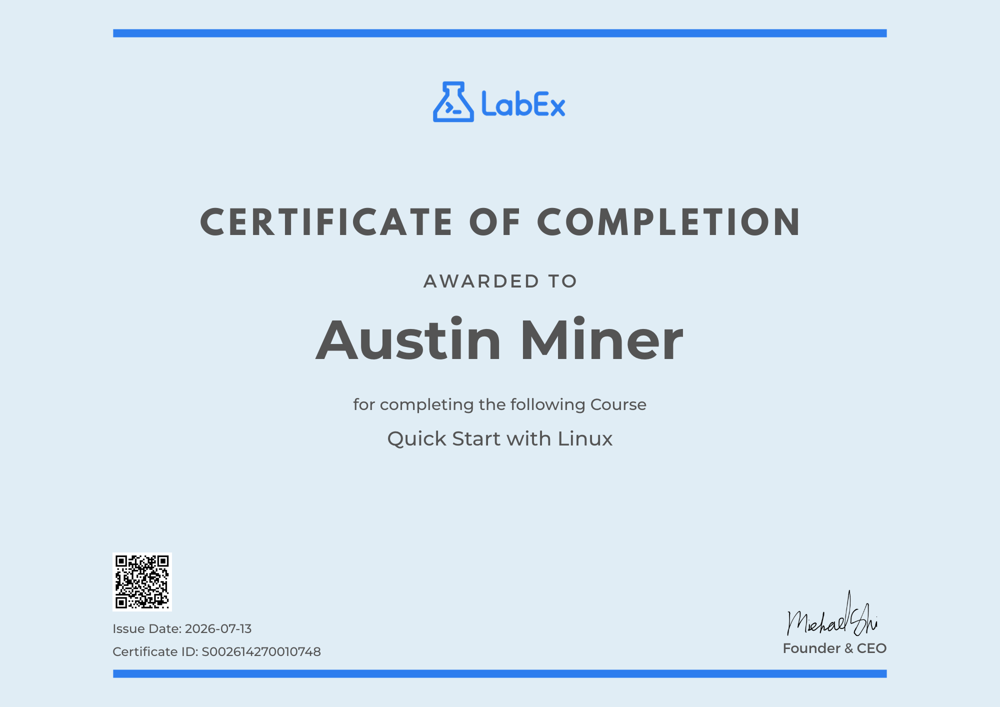
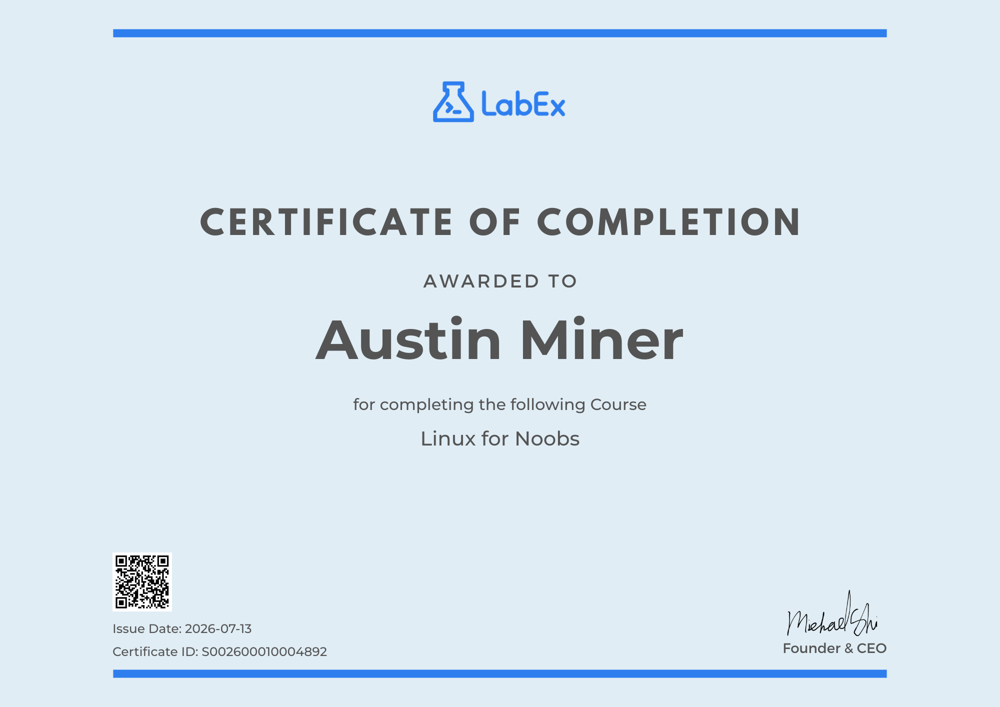
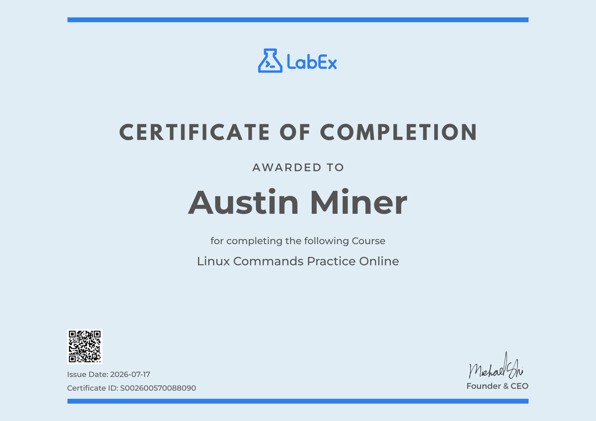

Completed "Quick Start with Linux"  — 5 hands-on labs and 5 challenges covering foundational Linux administration.
Skills gained:
- Linux command-line proficiency and core system operations
- File system navigation, file operations, and management
- User permissions and security management
- User account and group administration
- Basic system configuration, maintenance, and troubleshooting
- Fundamental networking and connectivity concepts

Completed "Linux for Noobs" via LabEx — 13 hands-on labs  and 12 Challenges. An intermediate Linux course building on foundational skills toward advanced system administration.
Skills gained:
- Confident navigation of the Linux file system
- User, group, and file permission management (Linux security model)
- Advanced file operations: searching and compression
- Text processing with regular expressions and command-line tools
- Development environment setup and customization (environment variables)
- Software package installation and management
- Basic system administration: disks, logs, and configuration
- Command pipelines and data stream redirection for complex, multi-step operations

Completed "Practice Linux Commands" via LabEx — 31 hands-on labs,  practice with core Linux terminal commands for file management, text processing, and system monitoring.
Skills gained:
- File & directory management (ls, cd, pwd, mkdir, rm, mv, cp)
- File viewing and concatenation (cat, nl, more, less, head, tail)
- Command discovery and file location (which, whereis, find, xargs)
- Text processing & search (grep, cut, paste, tr, wc)
- Text sorting and comparison (sort, uniq, join, comm, diff, patch)
- Disk usage and space estimation (df, du)

Continuing to build hands-on Linux command-line fluency for cybersecurity/SOC analyst work — real command-level reps, not just theory.

